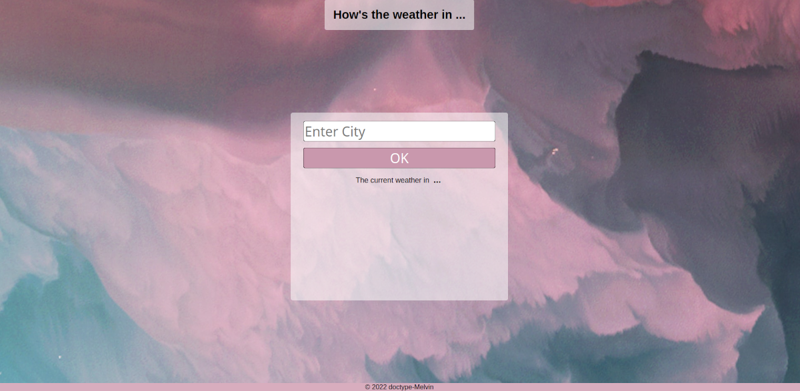

# Weather App
Using API to create a weather app with HTML, CSS and JavaScript.
[Live Demo](https://doctype-melvin.github.io/weather-app/)

## Features
This app takes a valid city name and displays basic current weather data
for the requested city. Depending on the weather condition a - *mostly* - 
fitting GIF is being displayed.

### Built using
* HTML
* CSS
* JavaScript
* JS Promises
* JS Async
* API

### Gallery
